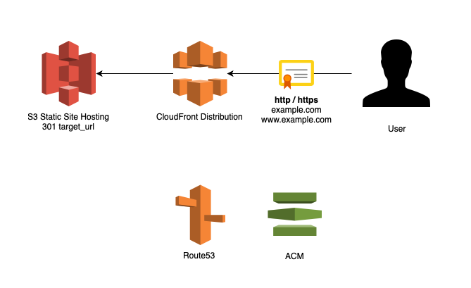

# Route53 Domain Redirect

This Terraform module works together with AWS Route53, S3, ACM and CloudFront to create permanent redirect of a domain to a target URL.

Both www and apex A records are created and pointed to a CloudFront distribution. The distribution accepts HTTP and HTTPS connections (free autorenewing ACM certificate is used for HTTPS). The origin for CloudFront distribution is a S3 hosted website with redirect-all rule. This solution is cheap and maintenance free.

**Requirements:** DNS Zone in Route53

## Inputs

| Name | Description | Type | Default | Required |
|------|-------------|:----:|:-----:|:-----:|
| target\_url | URL to redirect to | string | n/a | yes |
| zone | Route53 zone name | string | n/a | yes |

